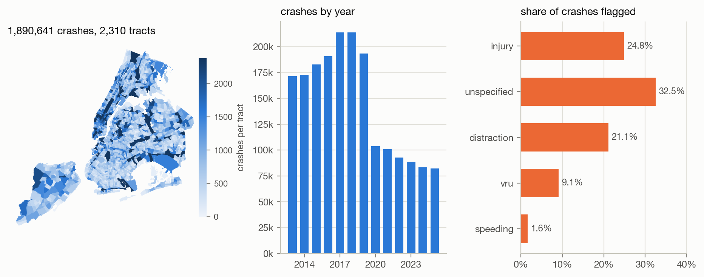
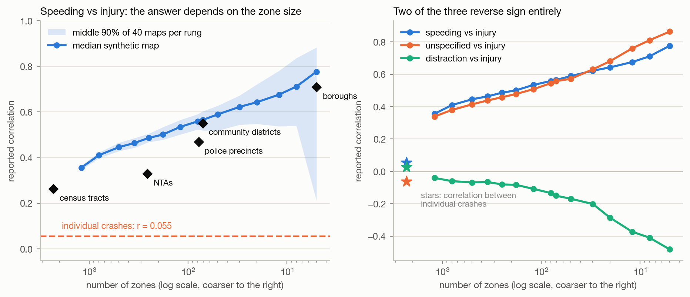
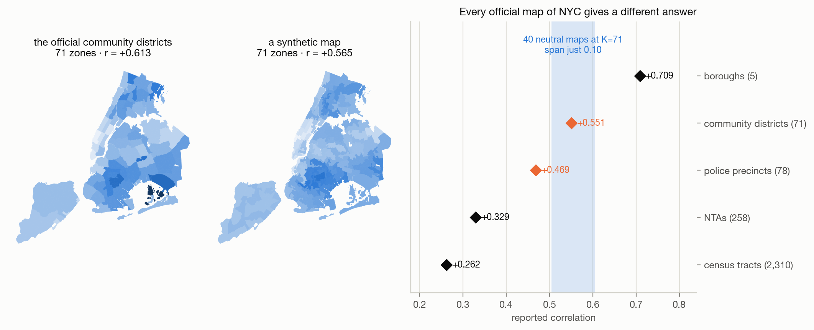
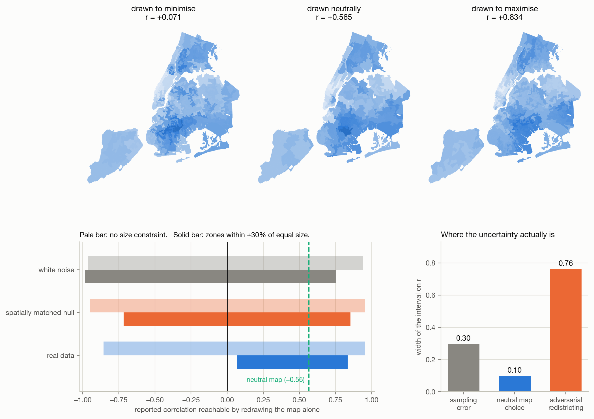
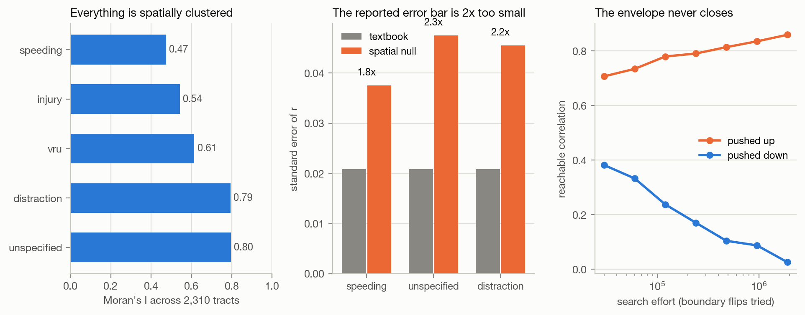
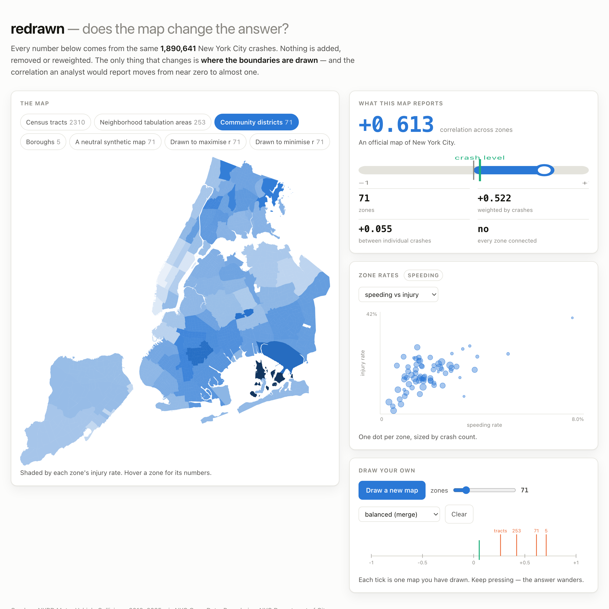
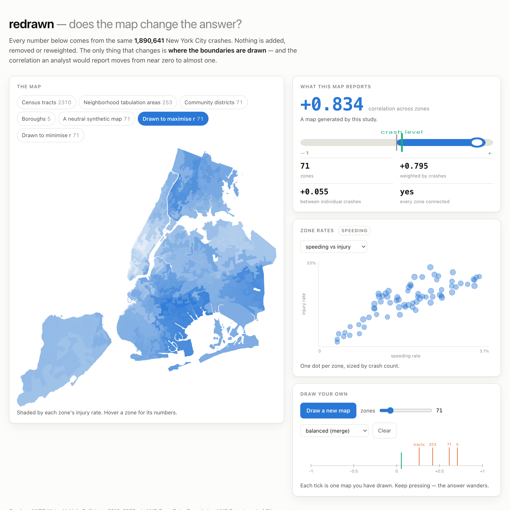

# redrawn

**Same 1.9 million crashes, same city, same question. Draw the districts one way and the answer is 0.05. Draw them another way and it is 0.83.**

[](https://github.com/UsmarHaider/redrawn/actions/workflows/ci.yml)
[](https://www.python.org/)
[](https://numpy.org/)
[](https://scipy.org/)
[](https://fastapi.tiangolo.com/)
[](https://usmar-redrawn.static.hf.space/)
[](LICENSE)

**[▶ Try the live demo](https://usmar-redrawn.static.hf.space/)** — pick an official map of New York, watch the correlation change, then draw your own and watch it change again.

---

- [The problem](#the-problem)
- [The data](#the-data)
- [1. The same crashes, seven answers](#1-the-same-crashes-seven-answers)
- [2. Two official maps, same size, different answer](#2-two-official-maps-same-size-different-answer)
- [3. Drawing the districts to order](#3-drawing-the-districts-to-order)
- [4. The control that spoils the trick](#4-the-control-that-spoils-the-trick)
- [5. The error bar is the wrong size too](#5-the-error-bar-is-the-wrong-size-too)
- [Where the uncertainty actually is](#where-the-uncertainty-actually-is)
- [The interface](#the-interface)
- [Key design decisions](#key-design-decisions)
- [Limitations](#limitations)
- [Reproduce it](#reproduce-it)
- [Project layout](#project-layout)

---

## The problem

Almost every published fact about a city is a fact about *zones*: injury rates by
neighbourhood, poverty by district, turnout by precinct. But the zones are not in
the data. Someone drew them, for reasons that had nothing to do with your
question, and you inherited them.

This is the **modifiable areal unit problem**, named by Openshaw in 1984 and
comprehensively ignored ever since. It has two halves. Aggregate the same points
into bigger zones and correlations inflate — that is the *scale* effect, and it
is the spatial form of the ecological fallacy Robinson described in 1950. Keep
the number of zones fixed but move the boundaries and the answer moves too — the
*zoning* effect, which is far less often checked because it requires alternative
maps that usually do not exist.

This repository builds those maps. It takes 1.9 million geocoded New York City
crashes, asks one ordinary question of them, and then answers it under every
official partition of the city, under 560 synthetic ones, and finally under
partitions drawn by a search whose explicit objective is to make the answer come
out however I like.

The question is a real one from road-safety policy: **do neighbourhoods where
speeding is cited more often also have more injurious crashes?**

The headline results:

| | speeding vs injury |
|---|---|
| Correlation between individual crashes | **+0.055** |
| …across 2,310 census tracts | +0.262 |
| …across 258 neighbourhood tabulation areas | +0.329 |
| …across 78 police precincts | +0.469 |
| …across 71 community districts | +0.551 |
| …across 5 boroughs | **+0.709** |
| Equal-size contiguous maps drawn to order | **+0.07 to +0.83** |
| The same search, on data with no relationship at all | −0.72 to +0.85 |
| Textbook standard error, versus one that allows for clustering | **1.8× too small** |

## The data

[NYPD Motor Vehicle Collisions](https://data.cityofnewyork.us/Public-Safety/Motor-Vehicle-Collisions-Crashes/h9gi-nx95),
one row per reported crash, via NYC Open Data. Boundaries are the Department of
City Planning layers: 2020 census tracts, neighbourhood tabulation areas,
community districts and police precincts. Everything is public and keyless.

From 2,269,187 downloaded rows: 2,132,218 fall in the whole-year window 2013–2025,
1,899,905 of those carry a plausible New York coordinate (the rest are blank or
at latitude zero), and 1,890,785 land inside a census tract.

**1,890,785 crashes · 2,310 tracts · 13 years · 633 crashes in the median tract**



Two properties of each individual crash are used throughout. `injury` is whether
anyone was hurt (24.8% of crashes); `speeding` is whether "Unsafe Speed" was the
first contributing factor recorded (1.6%). Both are attributes of one crash, so
the correlation between them at the individual level is a well-defined quantity —
which is the whole basis for comparing it against the zone-level numbers.

Two further pairs are carried along as robustness checks: `unspecified` (no
contributing factor recorded, 32.5%) and `distraction` (21.1%), each against
`injury`. `vru` — a pedestrian or cyclist was hurt — is reported in the data
summary but never correlated with `injury`, because a crash that injures a
pedestrian has by construction injured someone and the correlation would measure
the definition rather than the city.

**No GIS dependency.** Point-in-polygon, polygon adjacency, centroids and line
simplification are written out in NumPy in [`geometry.py`](src/redrawn/geometry.py)
— about 200 lines, no geopandas, no shapely, no GDAL. The check that this is
right: DCP publishes its own tract→NTA crosswalk, so routing each crash through
its tract must agree with testing that crash against the NTA polygons directly.
It agrees on **99.9966%** of 1.89 million crashes.

## 1. The same crashes, seven answers

Aggregating to coarser zones does not merely add noise. It moves the answer, in
one direction, a long way.



The blue line is 40 independently generated contiguous maps at each zone count;
the band is the middle 90% of them. The black diamonds are the real maps of New
York. The relationship between speeding and injury is **thirteen times stronger
across boroughs than across crashes**, and nothing was added to the data to make
that happen — averaging inside zones removes the individual-level variation that
was diluting the correlation, and the coarser the zones the more of it goes.

The right panel shows this is not special to one pair of variables. It also shows
something worse. Of the three pairs, **two reverse sign entirely** between the
individual level and the borough level:

| pair | between crashes | across tracts | across boroughs |
|---|---|---|---|
| speeding vs injury | +0.055 | +0.262 | +0.709 |
| unspecified vs injury | **−0.061** | +0.210 | **+0.845** |
| distraction vs injury | **+0.027** | +0.001 | **−0.646** |

Crashes with no contributing factor recorded are *less* likely to involve an
injury (21.0% versus 26.7%). Boroughs where more crashes have no factor recorded
are *much* more likely to be injurious. Both statements are true, computed from
identical rows, and they point in opposite directions. Anyone reporting the
second as a fact about causes of injury is reporting a fact about paperwork
aggregated over 380,000 crashes per borough.

## 2. Two official maps, same size, different answer

The scale effect at least has a direction you can reason about. The zoning effect
does not, and it shows up in the real maps of New York without any synthetic
construction at all.



New York is partitioned into **71 community districts** and, quite separately,
**78 police precincts**. Near-identical granularity, both drawn by the city, both
perfectly defensible units for a road-safety analysis:

- community districts: **r = +0.551**
- police precincts: **r = +0.469**

That gap is not sampling noise. Forty neutral, contiguous, size-balanced maps at
71 zones span only **+0.505 to +0.604** — a range of 0.099 — so the difference
between two real maps of the same city is comparable to the entire spread of
maps drawn without looking at the data. Which of the two numbers gets published
depends on which agency the analyst happened to work with.

## 3. Drawing the districts to order

If the map moves the answer, the obvious question is how far it can be pushed on
purpose. [`gerrymander.py`](src/redrawn/gerrymander.py) anneals over contiguous
71-zone partitions of the 2,310 tracts. The move is a single boundary flip — hand
one tract to a neighbouring zone — rejected unless the donor zone stays non-empty
**and stays connected**, so every map the search visits is one somebody could
actually propose. The objective is the correlation the resulting map reports.

Not one crash record is added, moved, or reweighted. Only the boundaries move.



Starting from a neutral map at +0.565, and holding every zone within ±30% of
equal crash count — roughly the population-balance constraint real districting
law imposes — the search reaches:

**+0.071 to +0.834.**

Without the size constraint it reaches −0.856 to +0.954, which is very nearly the
entire range a correlation can take.

## 4. The control that spoils the trick

The section above is the sort of result that invites an overclaim, so here is the
control that stops it.

Run the identical search against a **spatially matched null**: a fake map of
injury rates carrying the real variable's exact distribution and comparable
spatial clumpiness (Moran's I matched by bisection), but with no relationship
whatsoever to speeding. Whatever the search reaches there is manufactured, not
found.

| search target | unconstrained | equal-size |
|---|---|---|
| real data | −0.856 to +0.954 | +0.071 to +0.834 |
| spatially matched null (no relationship) | −0.950 to **+0.955** | −0.716 to +0.853 |
| white noise | −0.966 to +0.940 | −0.983 to +0.754 |

**Unconstrained redistricting reaches +0.955 on data where the true relationship
is exactly zero — a shade higher than it reaches on the real thing.** The ratio
of envelope widths is 0.95: the real data gerrymanders *slightly worse* than
noise, because genuine structure gets in the search's way.

So the honest reading of section 3 is not "look how strong the signal is." It is
the reverse: **at 71 zones over 2,310 building blocks, "contiguous" is such a weak
constraint that a search can produce nearly any correlation from nearly any data,
and an unconstrained zoning-robustness check is worth nothing.** The equal-size
constraint is what does the real work, and even it leaves the real data spanning
0.76 of correlation.

There is a second reason not to trust the exact numbers above, and it is not a
caveat so much as a finding. **The envelope never stops widening.**

| search effort (boundary flips) | equal-size envelope |
|---|---|
| 30,000 | +0.382 to +0.707 |
| 120,000 | +0.238 to +0.780 |
| 480,000 | +0.104 to +0.814 |
| 1,920,000 | **+0.026 to +0.859** |

Sixty-four times the search budget and it is still moving, with no sign of a
plateau. Every width in this repository is therefore a **lower bound** on what
redistricting can do — and so is every published robustness check that tries a
fixed number of alternative maps and reports the spread.

## 5. The error bar is the wrong size too

Underneath all of this sits an assumption nobody states: that the zones are
independent observations. They are not. Neighbouring tracts share traffic,
streets, and the reporting habits of the same precinct.



Moran's I — hand-implemented, with permutation inference — is **+0.47 to +0.80**
for every indicator across the 2,310 tracts (p = 0.002, the floor at 499
permutations). Testing the tract-level correlation against surrogate maps that
preserve that clumpiness but destroy any link to speeding gives a null spread of
0.038 against the textbook standard error of 0.021: the reported error bar is
**1.8× too narrow** for speeding, 2.3× for unspecified, 2.2× for distraction.

The direction of the conclusion survives here — speeding vs injury clears the
spatial test at p = 0.002 — but the confidence interval an analyst would print is
about half the width it should be. Distraction vs injury, which is a flat +0.001
across tracts, is correctly read as nothing by both tests (p = 0.97 spatial).

## Where the uncertainty actually is

Three sources of uncertainty in the same statistic, in the same units:

| source | interval on r | width |
|---|---|---|
| Sampling error at 71 zones (Fisher) | +0.443 to +0.741 | **0.297** |
| Neutral map choice, 40 maps, no search | +0.505 to +0.604 | **0.099** |
| Equal-size adversarial redistricting | +0.071 to +0.834 | **0.763** |

The first is the only one that appears in a paper. It is not the largest. Even
the second — the spread you get from maps drawn with no knowledge of the data at
all — is a third of the reported sampling width, and it is conventionally treated
as zero.

None of this makes the underlying finding false. Speeding really is associated
with injury, at every scale, and the association survives a spatial null. What
moves is the *number*, by more than the stated precision, entirely as a function
of a choice the analyst usually does not know they made.

## The interface

A self-contained page — one HTML file, one JavaScript file, no build step, no
CDN — that re-runs the study live. It ships the per-tract crash counts and the
tract adjacency graph, and recomputes zone totals, rates and the correlation in
the browser every time you change the map. Nothing displayed is precomputed.



Pick any official map of New York; draw new contiguous ones at any zone count
with the slider; watch each answer land as a tick on the strip at the bottom. The
contiguity badge reports "no" on the real community districts and NTAs, which is
correct — several of them contain islands, and the synthetic maps this study
generates are strictly more contiguous than the official ones.

Here is the same page on the map the annealer drew to maximise the correlation:



The browser port ([`maup.js`](src/redrawn/ui/maup.js)) is a second implementation
of the analysis and could drift from the Python. It cannot drift silently:
[`test_js_parity.py`](tests/test_js_parity.py) runs that exact file under Node
and requires agreement to **1e-12** on twelve different maps, unweighted and
weighted, plus that its own map generator produces exactly K connected zones.

## Key design decisions

**Merging the lightest adjacent pair, not growing from seeds.** The first version
grew synthetic maps from random seeds and produced one continent and a thousand
islands — max/median crash count of 8.3, against 2.3 for the real community
districts. An unbalanced synthetic family would have confounded every comparison
against the real maps. Agglomerating the two lightest adjacent zones instead
gives 1.6, so the synthetic maps are *more* balanced and *more* contiguous than
the official ones, which puts the confound in the safe direction. The ragged
region-growing family is kept as a contrast and is reported separately: at 71
zones it spans +0.262 to +0.581, far wider, because unbalanced maps are easier to
move.

**Two nulls, not one.** White noise alone would have been an unfairly easy
control: a search cannot exploit spatial clustering that is not there. The
spatially matched surrogate — same histogram, same Moran's I, no relationship to
x — is the null that actually tests the claim, and it is the one that showed the
unconstrained gerrymander to be uninformative.

**Reporting search effort as a result.** The convergence table is not a
diagnostic that passed; it is the finding that no such diagnostic can pass.

**One search budget for every scenario.** Real data, spatial null and white noise
all get 800,000 flips and 2 restarts per direction, so the comparison between
them is not an artefact of unequal effort.

## Limitations

- **Crash reports are not crashes.** Contributing factors are recorded by the
  officer at the scene, "Unspecified" is the single most common value at 32.5%,
  and reporting practice plausibly varies by precinct — which is one reason the
  `unspecified` pair behaves as strikingly as it does.
- **10% of rows have no usable coordinate** and are dropped. If geocoding failure
  is spatially patterned, the tract counts inherit that pattern.
- **No denominators.** Rates here are per *crash*, not per resident, per vehicle
  mile or per road kilometre. A neighbourhood-level road-safety analysis would
  want exposure data; this study needs only a quantity that changes when the
  boundaries change.
- **The envelope is a lower bound**, as section 4 shows, and by an unknown
  amount.
- **Community districts are represented by CDTAs** in the tract-nested family, so
  that all partitions compared there are partitions of the same 2,310 tracts.
  Scored on its own polygons the community-district map gives +0.551 rather than
  +0.613; both numbers appear above and the difference is itself a small zoning
  effect.
- **Adjacency is rook contiguity from shared boundary segments**, with
  disconnected components bridged by nearest centroid. Staten Island is joined to
  Brooklyn by what is, in effect, the Verrazzano-Narrows Bridge.
- **Association only.** Nothing here identifies a causal effect of speeding on
  injury, at any scale.

## Reproduce it

```bash
git clone https://github.com/UsmarHaider/redrawn && cd redrawn
make venv          # a virtualenv and the dependencies
make test          # 92 tests, fully offline, no data needed
make all           # download, geocode, analyse, plot, export  (~25 min)
make serve         # the interface on http://localhost:8000
```

`make all` re-derives every number in this README from the raw open data and
prints them with `make summary`. The slow step is geocoding: two million
point-in-polygon tests against four boundary layers, about eight minutes, cached
afterwards.

The test suite never touches the network or the downloaded data — every test
builds its own small synthetic city with known ground truth, which is why CI runs
in under a minute on three Python versions.

## Project layout

```
src/redrawn/
  config.py        paths, dataset ids, the study's constants
  geometry.py      hand-rolled GIS: point-in-polygon, adjacency, simplification
  data.py          cleaning, geocoding against four layers, cached tables
  partitions.py    official / merged / grown map families, and how to score one
  gerrymander.py   simulated annealing over contiguous partitions
  stats.py         correlation, sparse spatial weights, Moran's I, spatial nulls
  analysis.py      the five experiments, each writing one JSON to reports/
  figures.py       the README figures
  web.py           payload export and the FastAPI service
  cli.py           `python -m redrawn.cli <step>`
  ui/index.html    the interface
  ui/maup.js       the analysis, ported to the browser (parity-tested)
scripts/           data download, screenshots
tests/             92 offline tests, including Python↔JavaScript parity
```

---

Crash data and boundaries: [NYC Open Data](https://opendata.cityofnewyork.us/),
public domain. Built with NumPy, pandas, SciPy, matplotlib and FastAPI.
